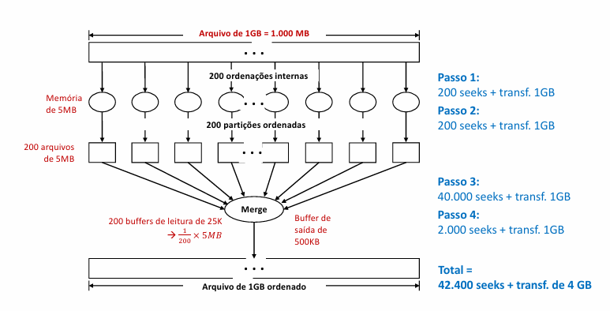

# Aula 7

### Processamento cossequencial

- Processa duas listas, de modo a formar uma terceira, que é a junção das duas.
- As listas devem estar ordenadas por chave e não devem possuir chaves duplicadas

**Tipos:**
- Mathc (Interseção)
- Merge (União/Intercalação)

- Bem fácil de entender e implementar o algoritmo
- As duas listas devem ser lidas antes
- Ordenação na memória RAM
- Feito com as CHAVES
- Complexidade é O(n + m)

### Intercalação Múltipla ou K-way Merge

- Intercala k arquivos ordenados, gerando um único arquivo de saída.
- OBS: Merge é uma forma de ordenação, mas match não é!!
- Mais fácil sem chaves 
- É caro

### Ordenação de Arquivos Grandes

- Grandes demais para a ordenação Interna
- Keysort tem um seeking muito alto para isso
- Keysort é limitado pelo uso da RAM

Imagine que temos um arquivo de 80 MB, mas apenas 1 MB de RAM para ordená-lo, e que a memória apenas para as chaves é de 8 MB

### Merge Sort Externo

1. Criar arquivos menores e ordenados que se chama partições
2. Trazer o máximo de registros possíveis para a memória, organizar internamente e depois salvamos em um arquivo temporário da partição
3. Repetir isso até que todas as partições sejam feitas
4. Utilizar o k-way merge para ordenar tudo, em que k são os números de partições

- Para o exemplo anterior, teríamos:
    - 1 MB de memória para 80 MB de registros, logo, precisam-se de 80 partições para compor tudo
    - Ou seja, 80 arquivos separados, que serão intercalados
    - Precisaremos de 80 buffers de leitura no final, ou seja, cada buffer pode ter no máximo 1/80 MB

- É extensível para qualquer tamanho de arquivo
- As partições são feitos de modo sequencial
- O merge também é sequencial, logo, é uma ordenação O(n)
- No fim, essa ordenação tem complexidade O(n²)
- Acessa o disco 4 vezes
- A fase de merging é um gargalo
- Número de seeks é k² + Tamanho do arquivo/tamanho do buffer de saída + 2k seeks para a leitura e escrita das partições
- Sem contar com os tempos de trasnferência

### Redução de custo do Merge Sort

- Vamos dividir as partições em blocos, que serão realizadas o merge de pouco em pouco
- Um merge para cada subgrupo
- Nesse caso, o buffer consegue carregar mais informações, diminuindo os seeks
- Ex: Merge 25 x 32-vias + 25 vias
    - Nesse caso, temos 32 partições divididas em 25 blocos e, no final, formam-se 25 arquivos para realizar o merge final
    - 1/32 * 1MB buffers de leitura para cada bloco
    - 32-way merge
    - Após fazer isso com todos os blocos, temos um buffer de leitura de 1/25 * 1MB, que faz um 25-way merge.
- Um 800-way merge gasta 800² = **640.000 seeks** no passo 3
- Com um merge de 2 passos para as mesmas condições, temos um gasto de 32² seeks e depois, com o último merge, 25 * 32² seeks. E, por fim, cada uma das 25 partições pode alocar 1/25 do buffer e, portanto, 32MB/40KB = 800 seeks por partição e, 25*800 = 20.000 seeks. Enfim, ele tem um total de **45.600 seeks**
- Aumenta trasnferência, mas diminui os seeks, que são mais custosos
- Aumentar o número de passos não implica em um merge melhor
- Temos também os seeks para a escrita extra dos dados, feitos no 1º e 2º merge com buffer de saída de 20K, logo, 2  * 800MB / 20KB = +80.000 seeks
- Não é um ganho tãaao colossal e continua O(n²)

### Exercício 1

- Arquivo a ser ordenado 1 GB
- Buffer de entrada é de 5 MB
- Buffer de Saída é de 500 KB

- Calcule o número de seeks e bytes transmitidos no MERGE SORT
    - Para o merge, teremos 200 partições
    - Agora, para o passo temos 200 seeks de leitura e 200 seeks de saída + transferência de 1GB para a leitura e a transferência de 1GB para a saída
    - Com 200 partições, para o merge temo 200² = 40000 seeks de leitura + transferência da 1 GB
    - Na escrita, teremos 1GB/500KB = 2000 seeks de escrita + transferência de 1GB
    - Custo total = 400 seeks + 40000 seeks +  2000 seeks + transferência de 4GB = **42.400 seeks + transferência de 4 GB**
    - Fórmula Final = k² + 2k + TamArq/TamBufSaída + 4*TamArq de transferência

### Exercício 2

- Arquivo a ser ordenado 1 GB
- Buffer de entrada é de 5 MB
- Buffer de Saída é de 500 KB

- Calcule o custo em termos de no Merge de seeks e bytes transmitidos do  Sort em dois passos na seguinte configuração: 10×20-vias + 10-vias
    - 20 partições em 10 blocos = 200 partições + 10 vias
    - Para o primeiro passo, temos a entrada de 200 seeks de entrada + 200 seeks de saída + transferência de 2GB = 400 seeks + transferência de 2 GB
    - Após isso, temos o primeiro merge, que utilizam 10*20² seeks, com a trasnferência de 2GB = 4000 seeks + 1 GB de transferência
    - Por fim, temos a saída com 1GB/500KB = 2000 seeks + 1 GB de transferência
    - Para o segundo merge, temos 200 * 10 seeks = 2000 seeks + 1 GB de transf
    - Por fim, temos 1GB/500KB = 2000 seeks + 1GB de transf para a saída
    - Enfim, o custo total é de: 400 seeks + 4000 seeks + 2000 seeks + 2000 seeks + 2000 seeks + 6GB de transf = **10400 seeks + 6 GB de transferência**
    - Fórmula final, para um merge de n x k + n, em que k são as partições, n são as vias = nk² + n²k + 2kn + 2TamArq/TamBufSaida + 6*TamArq de transferência

