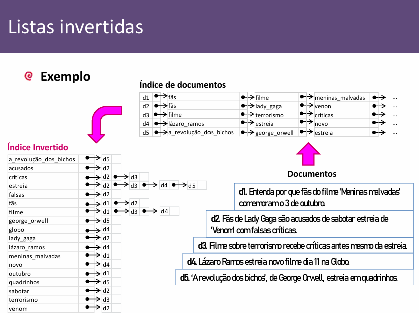

# Aula 8

### Índices Lineares

Índice é uma estrutura que visa facilitar a busca por chaves

Chaves Ordenadas + Referências (RRN ou Offset)

Os índices lineares são arranjos de pares chave/valor

Ordenam o arquivo sem que esse rearranjo seja físico

Acesso DIRETO de chaves e registros de tamanho fixo e variável

### Índice Primário

Cada registro tem uma chave primária e uma referência

Relação 1 para 1

Índice ordenado pela chave!

Podem ser mantidos em RAM ou em outro arquivo

Chave secundária pode ser repetida e é um outro campo do registro

A referência de chaves secundárias é para a chave primária, e não ao byte offset

### Listas Invertidas

Organizar o índice secundário de forma que cada registro contenha a chave secundária e um ponteiro para uma lista encadeada de chaves primárias (Mais fácil de inserir e modificar)

A lista invertida não é ordenada

O problema é que gera várias procuras e custos, mas ainda assim compensa

### Binding

Chamamos de ligação ou “binding” a associação feita entre uma chave e o endereço físico do registro ao qual ela se refere

Acontece no índice primário

### Early-binding
- Associa a chave ao endereço físico, no momento da criação do índice
- Alto custo de alteração, requer reordenação
- Menos seguro
- Bom para arquivo estático e que sobre poucas alterações
- Muito mais rápido

### Late-binding
- Associa a chave secundária a uma chave primária, que por sua vez se associa a um endereço físico
- Associação só ocorre na busca
- Mais lenta
- Baixo custo em alterações
- É desejável que modificações importantes sejam feitas em um único arquivo do que em vários arquivos